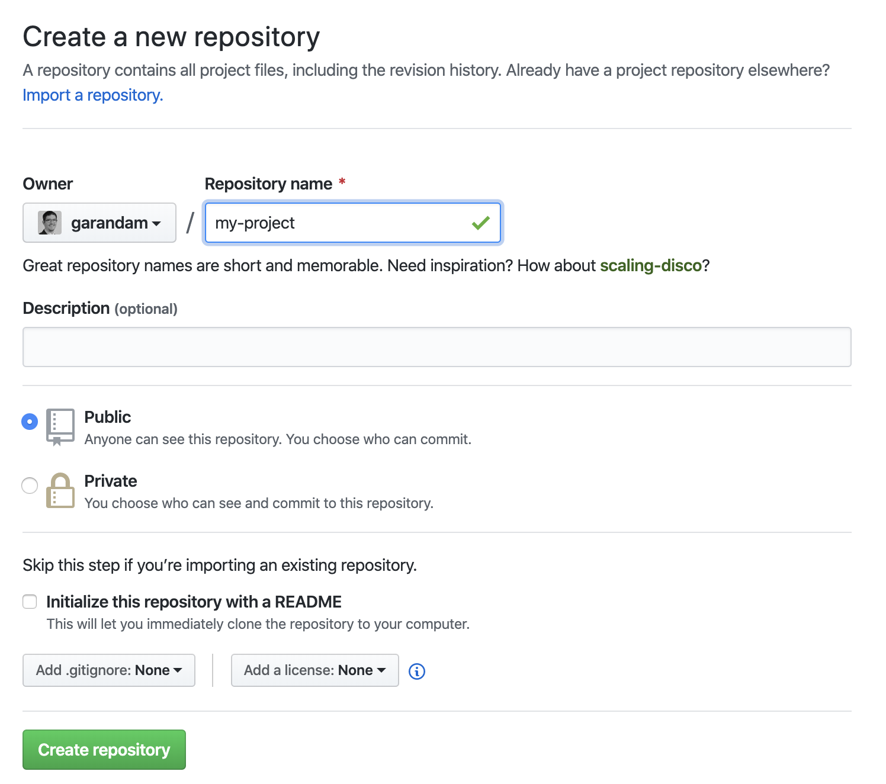

### PreRequisites

- Setup: Git (see other Blog-Post - coming soon)
- [Gatsby Tutorial - Install Git](https://www.gatsbyjs.org/tutorial/part-zero/#install-git)

### Create Github Account

[GitHub](https://github.com/)

### Create a new Repository on GitHub



### Setup local Project and connect with GitHub Repository (only once)

If you have no git repository initially:

```sh
$ cd projectName

$ git init

// Add all Files
$ git add .

// Commit with Message
$ git commit -m "initial commit"
```

or for a gatsby Blog, because the gatsby-CLI does `$ git init` for you

```sh
$ gatsby new projectName
$ cd projectName
```

push the code to GitHub

```sh
// Set remote server (GitHub)
$ git remote add origin git@github.com:[USER-NAME]/[PROJECT].git

// Sends everything to remote server (GitHub)
$ git push -u origin master
```

### Edit Files, Status, Add, Commit & Push

!!! IMPORTANT !!!

This step is essential, and the following commands should go in your blood & flesh that you don’t have to think about them. 😉

If you’re working alone on a project, then this workflow is, in general, more then enough to know

```sh
// Shows all changes within your Project
$ git status

// Add all (changed) Files to the staging area
$ git add .
// or add one specific File to the staging area
$ git add path/to/file

// Add all staged Files into Branch history with a commit message
$ git commit -m "your commit message"

// Sends all your committed changes of the current branch to the remote server (GitHub)
$ git push
```
